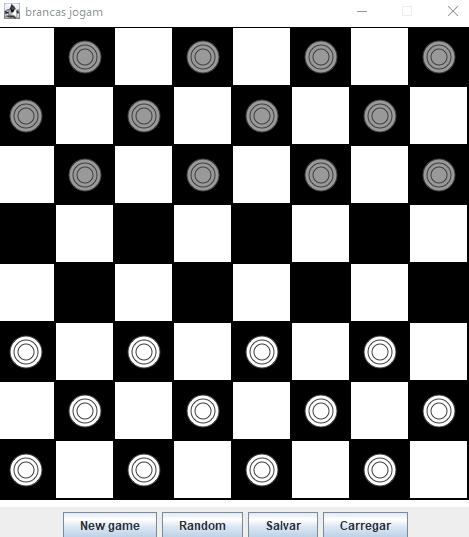
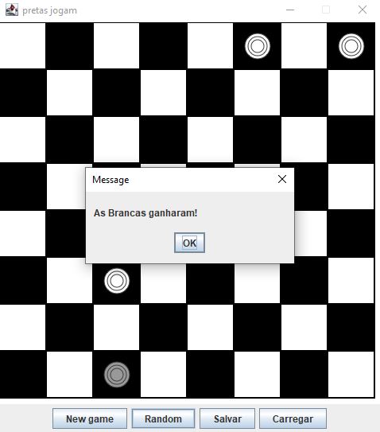

# Checkers (Damas) ⚫⚪

A fully playable **Checkers** game built in Java, with a clean split between game logic and GUI, configurable board sizes, save/load support, and a random-move assistant. Built as a university project using the `pt.iscte.guitoo` board framework.

## Features



- **Configurable board** - start a new game with any board size from 4×4 to 16×16 and a custom number of pieces per side, via the "New game" action.
- **Full move validation** - legal diagonal moves on dark squares only, mandatory captures (if a capture is available, a normal move is rejected), and turn switching after each move.
- **Save / Load** - save the current game state (board size, whose turn it is, and the full board) to a plain-text file, and reload it later via the "Carregar" action.
- **Random move assistant** - the "Random" action plays a random legal move for whoever's turn it is (prioritizing captures when one is mandatory), useful for quick testing or as a lightweight opponent.
- **Visual feedback** - the selected piece is highlighted, and the window title always shows whose turn it is.
- **Win/draw detection** - the game ends when a side has no pieces left or no legal moves, and the winner is decided by remaining piece count.



## How to Play

1. Click a piece to select it (only pieces belonging to the current turn can be selected - the game enforces this).
2. Click a diagonal destination square to move there.
3. If any of your pieces can capture, you must play a capture move - a regular move is rejected with a warning ("Tens de capturar").
4. The game announces the winner (or a draw) automatically once no side has pieces or legal moves left.

## Design

The project follows a simple **Model–View separation**:

- **`Damas`** (model) owns all game state and rules - the board, whose turn it is, move validation, capture logic, win/draw detection, and random-move generation. It knows nothing about rendering.
- **`View`** (controller/view) wires the `Damas` model to a `pt.iscte.guitoo` `Board`: it translates mouse clicks into model calls, renders piece icons and highlighting through provider callbacks, and handles the toolbar actions (new game, random move, save, load).

This keeps the rules of the game independent of how they're displayed - the same `Damas` model could be driven by a text UI or a different GUI without any changes to its code.

**Ruleset:** this is "checkers without kings" - pieces never get promoted, so they can only ever move diagonally forward, never backward. Captures are mandatory whenever available, but only single-hop (no chained multi-captures within one turn).

## Tech Stack

- **Java**
- `pt.iscte.guitoo` - a lightweight board-game GUI framework used in ISCTE courses (provides the `Board` component, mouse handling, and prompt dialogs)

## Save File Format

Saved games are plain text:

```
<board size>
<true|false>          # true = white's turn
<board rows, one per line, using 'W', 'B' and ' '>
```

## Running the Game

**Requirements:** Java JDK 8+, and the `pt.iscte.guitoo` library on the classpath.

> Note: `pt.iscte.guitoo` is provided by the course and isn't bundled in this repository, so it needs to be added separately to compile and run. If you just want to see it in action, check the GIF and screenshot above instead of cloning.

1. Clone the repository and open it in your IDE (Eclipse/IntelliJ), making sure `pt.iscte.guitoo` is added as a dependency.
2. Run `View.java` - it launches a new 8×8 game with 12 pieces per side.
   ```bash
   java -cp bin:path/to/guitoo.jar View
   ```

## Author

**Gonçalo Sobral** - [GSobral99](https://github.com/GSobral99)

Developed as coursework at ISCTE.